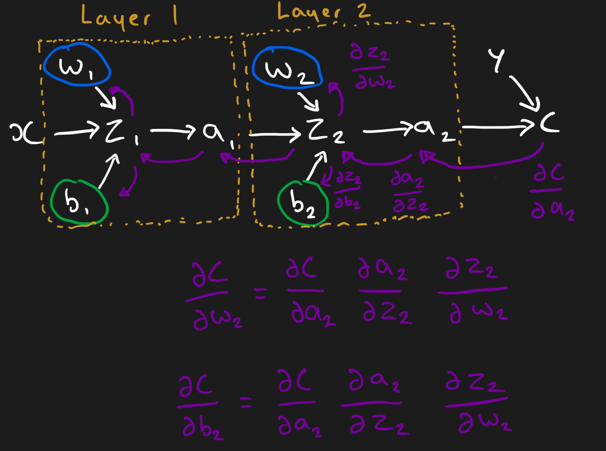

# Neural network framework

Custom implementation of core neural network fundamentals designed to replicate the base functions of Tensorflow.

I wrote this library to teach myself the basics of neural networks, specifically back propagation.

The library aims to provide a simple, modular and extendable interface to create and train basic models with greater levels of experimentation and additions.

## Features

- Layers (Input, Dense, Dropout)
- Activations (RELU, Linear, Sigmoid, Softmax)
- Loss functions (MSE, Binary cross entropy, Categorical cross entropy)
- Optimisers (Stochastic gradient descent, Decaying SGD)
- Extra (Saving/loading models with Pickle, Plotting of training)

## Future additions

- Accuracy metrics
- Recurrent layers (RNNs, LSTMs, GRUs)
- Convolution layer
- More optimisers (Adam, AdamW)

## Installation & Usage

### Clone repository

```sh
git clone https://github.com/ethanmidgley/neural-network-framework.git
cd neural-network-framework
```

### Install dependencies

```sh
pip install -r requirements.txt
```

### Building & training a model

```py
m = Model()
m.add(Input(784))
m.add(Dense(128, Sigmoid))
m.add(Dense(64, RELU))
m.add(Dense(1, Sigmoid))

m.compile(metric=BinaryCrossEntropy)

m.train(X_train, Y_train, epochs=10)
```

Above is a super simple model for binary classification.

More examples can be found in the [examples](https://github.com/ethanmidgley/neural-network-framework/blob/master/examples) folder

## Back propagation

This was the toughest part of the building the framework. I found it very hard to debug where errors had been introduced in this process.

Further, another difficulty was in the derivatives of complex functions such as Softmax and Categorical cross entropy. Luckily there are a lot of resoures available such as the book linked in the credits and a 3Blue1Brown video explaining the overall process of back propagation.



In the above diagram the white arrows is showing the feed forward nature of the neural networks making a prediction. The purple arrows going backwards is the back propagation process.

The act of training is thought of as minimising error/cost represented by $C$ in the diagram above. As the error can only be calculated at the end of the model, with the comparison between expected and actual the error has to be propagated backwards through the model.

To minimise the cost gradient descent is used, to achieve this the effect(gradient) of each weight and bias needs to be known, again the process of passing back of these gradients & error is the backwards propagation.

We can calculate the effect from a specfic weight on the cost by chaining together the gradients along the path. Examples of this can be seen with the derivative of the cost, $ C $ with respect to layer 2 weights, $ w_2 $ and layer 2 biases, $ b_2 $ below.

$$
    \frac{\partial C}{\partial w_2} = \frac{\partial C}{\partial a_2} \frac{\partial a_2}{\partial z_2} \frac{\partial z_2}{\partial w_2}
$$

$$
    \frac{\partial C}{\partial b_2} = \frac{\partial C}{\partial a_2} \frac{\partial a_2}{\partial z_2} \frac{\partial z_2}{\partial b_2}
$$

## Credits

I wanted to test my knowledge throughout this project, so I tried to avoid using following tutorials however some base knowledge and guidence was needed.

### Nueral network from scratch book

This book was used to consolidate the derivatives I had coded as well as helps with the operations behind back propagation.

[Website](https://nnfs.io)

### 3Blue1Brown video

This gave me a really good understanding of how back propagation is achieved through the chain rule, to which I have hopefully explained correctly above.

[Youtube](https://www.youtube.com/watch?v=tIeHLnjs5U8)
